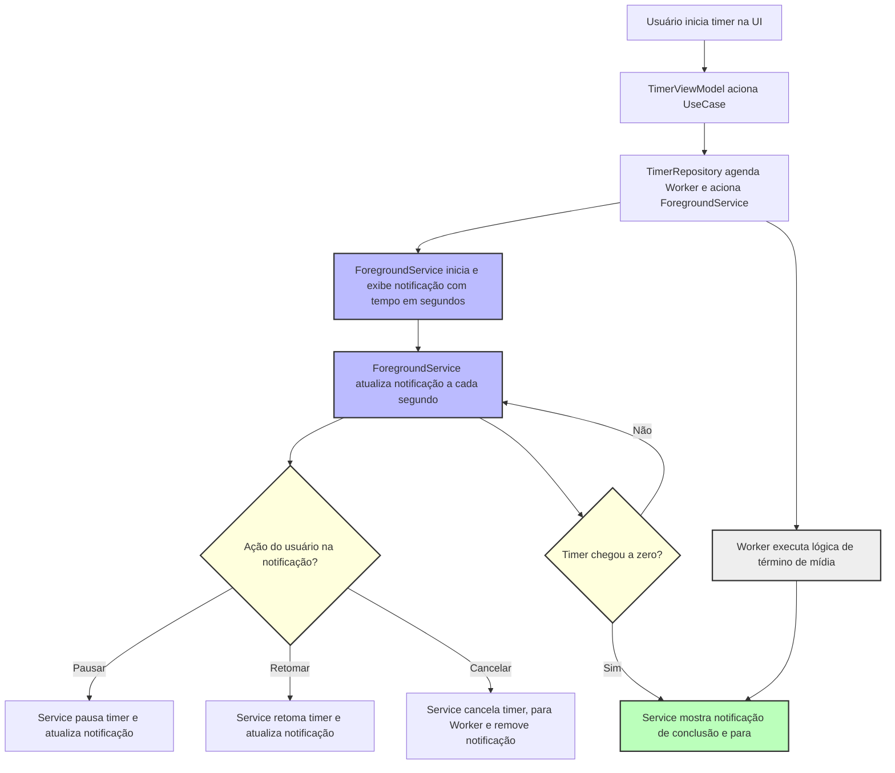

# Dormindo

Aplicativo Android para monitoramento e análise de padrões de sono.

## Sobre o Projeto

Este é um aplicativo Android desenvolvido em Kotlin usando Jetpack Compose e Clean Architecture. O objetivo é fornecer uma solução completa para monitoramento e análise de padrões de sono.

## Tecnologias Utilizadas

- **Kotlin** - Linguagem principal
- **Jetpack Compose** - UI declarativa
- **Material 3** - Design system
- **Room Database** - Persistência local
- **MVVM + Clean Architecture** - Arquitetura do projeto
- **Koin** - Injeção de dependências
- **Kotlin Flow** - Programação reativa

## Configuração do Ambiente

### Pré-requisitos

- Android Studio Hedgehog | 2023.1.1 ou superior
- Kotlin 2.0.21 ou superior
- Android SDK API 24+ (Android 7.0)
- Target SDK API 36 (Android 14)

### Instalação

1. Clone o repositório:
```bash
git clone [URL_DO_REPOSITORIO]
cd Dormindo
```

2. Abra o projeto no Android Studio

3. Sincronize o projeto com os arquivos Gradle

4. Execute o aplicativo em um emulador ou dispositivo físico

## Estrutura do Projeto

```
app/
├── src/
│   ├── main/
│   │   ├── java/com/example/dormindo/
│   │   │   ├── data/           # Camada de dados
│   │   │   │   ├── repository/ # Implementações dos repositórios
│   │   │   │   ├── datasource/ # Fontes de dados
│   │   │   │   ├── mapper/     # Mappers de dados
│   │   │   │   └── model/      # Modelos de dados
│   │   │   ├── domain/         # Camada de domínio
│   │   │   │   ├── entity/     # Entidades de negócio
│   │   │   │   ├── repository/ # Interfaces dos repositórios
│   │   │   │   └── usecase/    # Casos de uso
│   │   │   ├── presentation/   # Camada de apresentação
│   │   │   │   ├── screens/    # Telas do Compose
│   │   │   │   ├── viewmodel/  # ViewModels
│   │   │   │   └── navigation/ # Navegação
│   │   │   └── di/            # Injeção de dependências (Koin)
│   │   └── res/               # Recursos do Android
│   ├── test/                  # Testes unitários
│   └── androidTest/           # Testes de UI
├── build.gradle.kts           # Configuração do módulo
└── proguard-rules.pro        # Regras do ProGuard
```

## Arquitetura

O projeto segue os princípios da Clean Architecture com MVVM:

- **Presentation Layer**: UI com Jetpack Compose e ViewModels
- **Domain Layer**: Use Cases e entidades de negócio
- **Data Layer**: Repositórios e fontes de dados
- **Infrastructure Layer**: Implementações concretas

### Injeção de Dependências

O projeto utiliza **Koin** para injeção de dependências:

- **Módulos**: Configurados em `di/AppModule.kt`
- **ViewModels**: Injetados via `koinViewModel()` no Compose
- **Repositories**: Implementações mock disponíveis para desenvolvimento
- **Use Cases**: Injetados via factory pattern

## Navegação e Telas

O aplicativo agora utiliza **Jetpack Compose Navigation** para alternar entre diferentes telas. As principais telas disponíveis são:

- **Timer**: Tela principal para controle do timer e monitoramento de sono.
- **Forçar Parada**: Tela dedicada para interromper imediatamente todas as mídias, timers e processos relacionados, útil para situações em que o app não consegue parar normalmente.

### Como Navegar

- O usuário pode alternar entre as telas usando o menu de navegação disponível no app.
- A tela "Forçar Parada" está disponível para todos os usuários e exibe o timer atual, além de um botão para interromper tudo de forma forçada.

## Funcionalidades

- [ ] Monitoramento de sono
- [ ] Análise de padrões
- [ ] Relatórios e estatísticas
- [ ] Configurações personalizadas
- [ ] Notificações e lembretes
- [x] Navegação entre telas (Compose Navigation)
- [x] Tela "Forçar Parada" para interromper todos os processos de mídia/timer

## Timer em tempo real na notificação

A partir da versão X.X, o aplicativo permite acompanhar o timer em tempo real diretamente pela barra de notificações do Android. A notificação exibe a contagem regressiva em segundos e oferece botões de ação para pausar, retomar ou cancelar o timer sem precisar abrir o app.

### Como funciona
- Ao iniciar um timer, um Foreground Service é ativado para manter a notificação sempre atualizada.
- A notificação mostra o tempo restante em segundos, atualizando a cada segundo.
- O usuário pode pausar, retomar ou cancelar o timer diretamente pela notificação.
- Quando o timer chega a zero, a notificação é atualizada informando a conclusão e a reprodução de mídia é parada automaticamente.

### Fluxo da arquitetura



### Instruções de uso
1. Inicie um timer normalmente pela tela principal do app.
2. Acompanhe o tempo restante diretamente na barra de notificações.
3. Utilize os botões da notificação para pausar, retomar ou cancelar o timer a qualquer momento.
4. Ao finalizar, a notificação informará que a reprodução de mídia foi parada.

> **Observação:** Para garantir o funcionamento correto, mantenha as permissões de notificação ativas para o app.

## Desenvolvimento

### Branches

- `main` - Branch principal com código estável
- `develop` - Branch de desenvolvimento
- `feature/*` - Branches para novas funcionalidades
- `hotfix/*` - Branches para correções urgentes

### Commits

Siga o padrão Conventional Commits:

```
feat: adiciona nova funcionalidade
fix: corrige bug
docs: atualiza documentação
style: formatação de código
refactor: refatoração
test: adiciona ou corrige testes
chore: tarefas de manutenção
```

## Testes

- **Testes Unitários**: JUnit 4
- **Testes de UI**: Espresso e Compose Testing
- **Cobertura**: Meta de 80%+

## Licença

Este projeto está sob a licença MIT. Veja o arquivo [LICENSE](LICENSE) para mais detalhes.

## Contribuição

1. Fork o projeto
2. Crie uma branch para sua feature (`git checkout -b feature/AmazingFeature`)
3. Commit suas mudanças (`git commit -m 'Add some AmazingFeature'`)
4. Push para a branch (`git push origin feature/AmazingFeature`)
5. Abra um Pull Request

---

**Desenvolvido com ❤️ usando CursorRIPER Framework** 